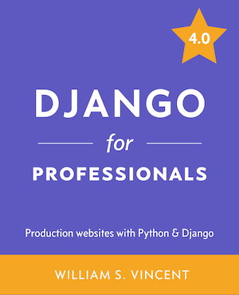

This repository is for [Django for Professionals](https://learndjango.com/courses/django-for-professionals/), a book about building apps with Django. The book covers Django 4 and Heroku. I moved on with Django 5 and AWS EC2.
